# 🌐 Cloud Computing Project - Dynamic Web Application Deployment

<div align="center">


**A complete guide to deploying a Next.js application on DigitalOcean with Nginx reverse proxy**

[🚀 Live Demo](http://164.92.81.236) 

</div>

---

## 📋 Table of Contents

- [🎯 Project Overview](#-project-overview)
- [🏗️ Architecture](#️-architecture)
- [🚀 Deployment Steps](#-deployment-steps)
- [🔧 Configuration Files](#-configuration-files)
- [📝 Troubleshooting](#-troubleshooting)

---

## 🎯 Project Overview

This project demonstrates the complete deployment of a **dynamic web application** using modern cloud infrastructure and DevOps practices.

### ✨ Key Features

| Feature | Technology |
|---------|------------|
| 🌐 **Frontend** | Next.js 15 with React |
| 🖥️ **Server** | DigitalOcean Ubuntu 22.04 |
| 🔄 **Reverse Proxy** | Nginx |
| ⚡ **Process Manager** | PM2 |
| 🔒 **SSL Certificate** | Let's Encrypt |
| 🎨 **Styling** | Tailwind CSS |

---

## 🏗️ Architecture

```mermaid
graph TB
    A[👤 User] --> B[🌐 Internet]
    B --> C[🔥 DigitalOcean Firewall]
    C --> D[🖥️ Ubuntu Server]
    D --> E[⚡ Nginx Reverse Proxy]
    E --> F[🚀 PM2 Process Manager]
    F --> G[⚛️ Next.js Application]
    
    H[📦 GitHub Repository] --> I[🔄 Git Pull]
    I --> G
    
    style A fill:#e1f5fe
    style G fill:#c8e6c9
    style E fill:#fff3e0
    style D fill:#f3e5f5
```



## 🚀 Deployment Steps

### 🔑 Step 1: SSH Key Generation

```bash
# Generated SSH key pair on my local machine
ssh-keygen -t rsa -b 4096 -C "my.email@gmail.com"

# Display public key to copy
cat ~/.ssh/id_rsa.pub
```

---

### 🖥️ Step 2: DigitalOcean Droplet Creation

| Setting | Value |
|---------|-------|
| **OS** | Ubuntu 22.04 LTS |
| **Plan** | Basic ($6/month) |
| **Region** | San Francisco |
| **Authentication** | SSH Key |

#### 🔧 Droplet Setup Commands:

```bash
# 1. Created droplet via DigitalOcean dashboard
# 2. Added my generated SSH public key
# 3. Copied the provided IP address
# 4. Connect via SSH

ssh root@MY_DROPLET_IP
```

---

### 🔥 Step 3: Firewall Configuration

```bash
# Created firewall rules
# Allowed SSH (22), HTTP (80), HTTPS (443)

# Via DigitalOcean Dashboard:
# Networking → Firewalls → Create Firewall
# Add rules for ports 22, 80, 443
```

#### 🛡️ Firewall Rules Table:

| Type | Protocol | Port Range | Sources |
|------|----------|------------|---------|
| SSH | TCP | 22 | All IPv4, All IPv6 |
| HTTP | TCP | 80 | All IPv4, All IPv6 |
| HTTPS | TCP | 443 | All IPv4, All IPv6 |

---

### 📦 Step 4: Server Dependencies Installation

```bash
# Update system packages
apt update && apt upgrade -y

# Install Node.js and npm
curl -fsSL https://deb.nodesource.com/setup_18.x | sudo -E bash -
apt install -y nodejs

# Install additional tools
apt install -y git nginx certbot python3-certbot-nginx

# Install PM2 globally
npm install -g pm2

# Verify installations
node --version
npm --version
nginx -v
pm2 --version
```

---

### 📁 Step 5: Project Deployment

```bash
# Create web directory
mkdir -p /var/www
cd /var/www

# Clone your repository
git clone https://github.com/yvehogan/cloud-school-second-semester-exam.git
cd cloud-school-second-semester-exam

# Install dependencies
npm install

# Build production version
npm run build

# Start application with PM2
pm2 start npm --name "nextjs-app" -- start

# Save PM2 configuration
pm2 save
pm2 startup
```


### ⚡ Step 6: Nginx Configuration

```bash
# Create Nginx configuration
nano /etc/nginx/sites-available/default
```

#### 📝 Nginx Configuration File:

```nginx
server {
    listen 80;
    server_name 164.92.81.236;

    location / {
        proxy_pass http://localhost:3000;
        proxy_http_version 1.1;
        proxy_set_header Upgrade $http_upgrade;
        proxy_set_header Connection 'upgrade';
        proxy_set_header Host $host;
        proxy_set_header X-Real-IP $remote_addr;
        proxy_set_header X-Forwarded-For $proxy_add_x_forwarded_for;
        proxy_set_header X-Forwarded-Proto $scheme;
        proxy_cache_bypass $http_upgrade;
    }
}
```

```bash
# Test and reload Nginx
nginx -t
systemctl reload nginx
```

---
### 🔄 Deployment Script

Create `/root/deploy.sh`:

```bash
#!/bin/bash
echo "🚀 Starting deployment..."

cd /var/www/YOUR_REPO
git pull origin main
npm install
npm run build
pm2 restart nextjs-app

echo "✅ Deployment complete!"
```

```bash
chmod +x /root/deploy.sh
```

---

### 🔍 PM2 Commands

| Command | Description | Usage |
|---------|-------------|-------|
| `pm2 status` | Show all processes | Monitor app status |
| `pm2 logs` | View application logs | Debug issues |
| `pm2 restart all` | Restart all processes | Apply updates |
| `pm2 monit` | Real-time monitoring | Performance tracking |


## 📝 Troubleshooting

### 🚨 Common Issues encountered & Solutions

| Issue | Symptom | Solution |
|-------|---------|----------|
| **502 Bad Gateway** | Nginx error page | Check if Next.js app is running (`pm2 status`) |
| **Connection Refused** | Can't access site | Verify firewall rules and Nginx config |
| **Build Failures** | npm run build errors | Check Node.js version and dependencies |
| **PM2 Not Starting** | App won't start | Check application logs (`pm2 logs`) |

### 🔧 Debug Commands

```bash
# Check application status
pm2 status
pm2 logs nextjs-app

# Test Nginx configuration
nginx -t
systemctl status nginx

# Check port usage
netstat -tlnp | grep 3000

# Test local connection
curl localhost:3000
```
### 👨‍💻 Project Information

- **Author**: Evelyn Ita
- **Course**: School of Cloud Engineering Second Semester Examination
- **Institution**: Alt School Africa
- **Live URL**: http://164.92.81.236

---

<div align="center">

### 🎉 Project Successfully Deployed!

[](https://github.com/YOUR_USERNAME/YOUR_REPO)
[](http://164.92.81.236)

</div>

